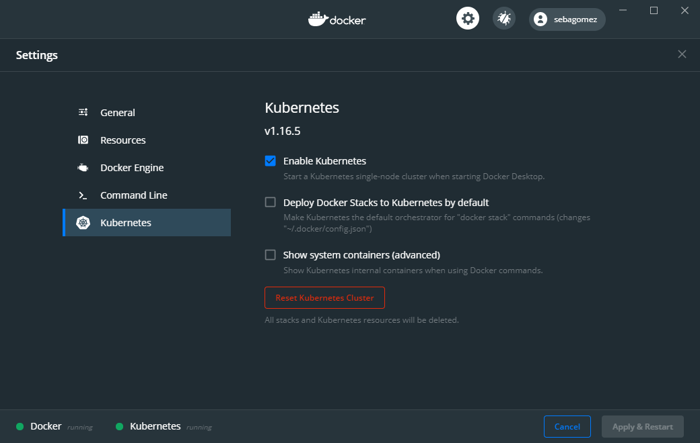

# Introducción a Kubernetes con GeneXus

Este repositorio contiene los scripts de las demos y las ppts de la charla con el mismo nombra dada para el Grupo Usuarios GeneXus el 4 Agosto de 2020.  

## Pasos previos

El único paso previo para ejecutar estas demos es tener el cliente de Docker ([Docker Desktop](https://www.docker.com/products/docker-desktop)) instalado (ya sea en Windows como en Mac).  
Una vez instalado y corriendo es necesario habilitar Kubernetes desde los settings.




## Demo 1

La Demo 1 fue simplemente levantar un container con la app web del GX29. Esta Docker image es pública y se encuentra en el repositorio GeneXus en Docker Hub.

Para eso lo único que hay que hacer es ejecutar el siguiebte comando:

```
$ docker run --rm -p 8888:8080 -d genexus/gx29_web
```

Esto levanta la web app en el puerto 8888 de la máquina de desarrollo y podemos acceder a la lista de speakers ejecutando la siguiente url en un browser.

> http://localhost:8888/servlet/com.gx29.website.speakers

## Demo 2 (Kubernetes)

La segunda demo ya fué sí con Kubernetes. Levantaremos la web app en nuestro cluster y veremos cómo acceder a él.  
Primero vamos a levantar el Dashboard Kubernetes. El Deashboard es una aplicación web que se comunica con el Master via la API y nos da UI de lo que está pasando. Para cuando uno arranca es muy útil.

Como todo web app que se levanta en Kubernetes, para aplicar el dashboard a nuestro cluster hay que sguir los siguientes pasos. En un futuro los pasos se pueden verificar en el repositorio del [Kubernetes Dashboard](https://github.com/kubernetes/dashboard). 
```
$ kubectl apply -f https://raw.githubusercontent.com/kubernetes/dashboard/v2.0.3/aio/deploy/recommended.yaml
```

Para acceder al dashboard necesitamos primero levantar el proxy
```
$ kubectl proxy
```

Y luego acceder a la url [http://localhost:8001/api/v1/namespaces/kubernetes-dashboard/services/https:kubernetes-dashboard:/proxy/](http://localhost:8001/api/v1/namespaces/kubernetes-dashboard/services/https:kubernetes-dashboard:/proxy/)

Esto nos va a levantar el dashboard al cual tenemos que entrar autenticando con un token que se obtiene con el siguiente comando:
```
$ kubectl -n kubernetes-dashboard describe secret $(kubectl -n kubernetes-dashboard get secret | grep admin-user | awk '{print $1}')
```

Ahora si, podemos analizar el dashboard en ir viendo qué va levantando a medida que aplicamos los scripts.

Primero nos paremos en una línea de comando en el directorio scripts de este repositorio para ejecutar los siguientes comandos.

1) Creamos el Namespace donde quiero crear mi aplicación
```
$ kubectl apply -f K8s-gx29-Namespace.yaml
```

2) Luego, solo para esta Demo, la base de datos también la tengo en una imagen, no es lo común.
```
$ kubectl apply -f K8s-AppGX29_DB.yaml
```

3) También queremos levantar un servicio de Redis para manejar las sesiones de la web app.
```
$ kubectl apply -f K8s-gx29-Redis.yaml
```

4) Por último, ahora si, la aplicación web.
```
$ kubectl apply -f K8s-AppGX29_Web-App.yaml
```

Ahora está todo levantado y queremos poder acceder a la app, pero tenemos que saber qué puerto nos asignó el cluster.
```
$ kubectl get svc -n gx29
```

De la lista de servicios nos interesa el de la web app (appgx29-web-svc) y de ese servicio, el puerto mapeado con el 8080 del servicio.  
Con ese puerto basta con poner esta url en el browser y así poder ver la lista de oradores: http://localhost:\<port\>/servlet/com.gx29.website.speakers

